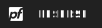
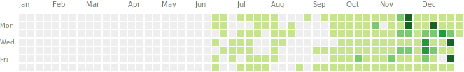

  

<h3 align="center">Design, deploy, manage, scale, optimize🌟</h3>

<!-- Removed external profile views badge to keep README fully offline -->

  

## 🚀 About Me

- I build and operate systems that are measurably fast, secure, and reliable.
- 25+ years delivering low-latency, high-throughput, production‑grade platforms.
- Obsessed with SLIs/SLOs, observability, and disciplined engineering.
- Ask me about performance tuning, reliability engineering, DevSecOps, and scaling.

## 🛠️ Tech Stack & Tools

### 💻 Languages

### 🎨 Frontend Frameworks

### ⚙️ Backend & Runtime

### 🗄️ Databases

### 🐳 DevOps & Cloud

### 💻 Operating Systems

### 🔒 Networking & Security

### 🖥️ Virtualization

### 🛒 E-Commerce

### 🔧 Development Tools

### 📦 File Management

## 📈 GitHub Stats & Activity

  
  
  
  
  
Shields badges are live (require internet).

---

### 📊 Contribution Graph

  
  
Live pull from GitHub contributions (requires internet).

---

### 🎖️ GitHub Achievements

<!-- Using the local assets we just copied -->

    

---

### 📈 Profile Metrics

  
  
  
  

---

### 🔥 Contribution Heatmap

  
  
Latest pull: 2026-01-06 (local snapshot)

## 🏆 Achievements

- 60–80% latency reductions via strategic caching and query tuning.
- Higher TPS while preserving data consistency and safety.
- Fewer P1 incidents with timeouts, retries/backoff, and circuit breakers.

## 📫 Connect With Me

    
      
    
    
    
    
    

- **👨‍💻 Developer**: Abdel_rahman
- **🏢 WebSite**: [Future Support](https://www.future-support.online/)
- **📧 Email**: <abdopcnet@gmail.com>
-  **GitHub**: [github.com/abdopcnet?tab=repositories](https://github.com/abdopcnet?tab=repositories)

**🤝 Need Support or Want to Join? Contact Now**

###  Egypt Contact

- 📞  **Call**: [+20 115 648 3669](tel:+201156483669)
-  **WhatsApp**:  [https://wa.me/201156483669](https://wa.me/201156483669)
-  **Telegram**: [https://t.me/EG_01156483669](https://t.me/EG_01156483669)

### 🌐 Online

- 🌐 **Website**: [future-support.online](https://www.future-support.online/)

<!-- Removed external activity graph to keep README fully offline -->

<!-- If you want a local graphic here, we can add a static SVG in imgs/ -->

---

<!-- Removed external quotes widget to keep README fully offline -->

---

  ⭐️ From <a href="https://github.com/abdopcnet">Abdo (abdopcnet)</a>

