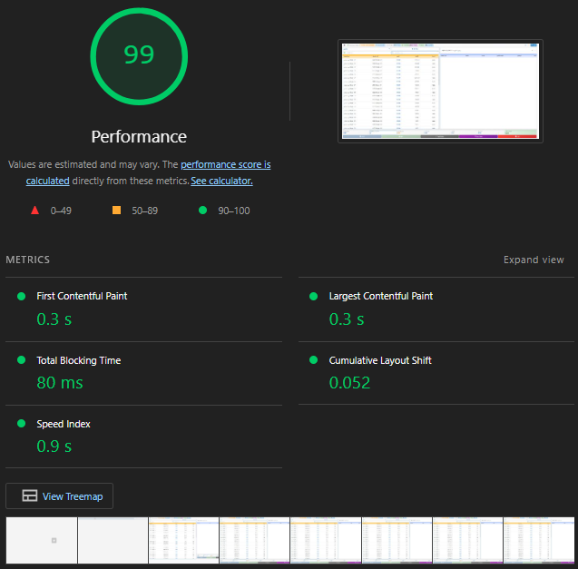
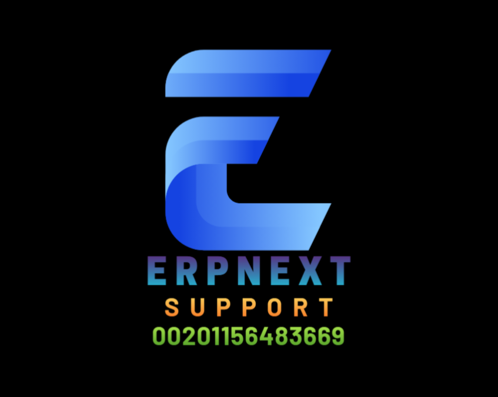

  

<h3 align="center">Design, deploy, manage, scale, optimize🌟</h3>

<!-- Removed external profile views badge to keep README fully offline -->

  

## 🚀 About Me

- I build and operate systems that are measurably fast, secure, and reliable.
- 25+ years delivering low-latency, high-throughput, production‑grade platforms.
- Obsessed with SLIs/SLOs, observability, and disciplined engineering.
- Ask me about performance tuning, reliability engineering, DevSecOps, and scaling.

## 🛠️ Tech Stack & Tools

### 💻 Languages

### 🎨 Frontend Frameworks

### ⚙️ Backend & Runtime

### 🗄️ Databases

### 🐳 DevOps & Cloud

### 💻 Operating Systems

### 🔒 Networking & Security

### 🖥️ Virtualization

### 🛒 E-Commerce

### 🔧 Development Tools

### 📦 File Management

## 📈 GitHub Stats & Activity

  
  
  
  
  

---

### 🔥 Contribution Heatmap

  

---

### 🎖️ GitHub Achievements

<!-- Using the local assets we just copied -->

    

## 🏆 Achievements

- 60–80% latency reductions via strategic caching and query tuning.
- Higher TPS while preserving data consistency and safety.
- Fewer P1 incidents with timeouts, retries/backoff, and circuit breakers.

## 📫 Connect With Me

    
      
    
    
    
    

## 👥 Developer Public Groups

    
    

-  **WhatsApp Group**: [ERPNext_Freelancers🔔](https://chat.whatsapp.com/D1ym5NjLjAQ598rw7Tsqb4)
-  **Telegram Group**: [ERPNext_Freelancers🔔](https://t.me/ERPNext_Freelancers)

<!-- Removed external activity graph to keep README fully offline -->

<!-- If you want a local graphic here, we can add a static SVG in imgs/ -->

---

<!-- Removed external quotes widget to keep README fully offline -->

---

  ⭐️ From <a href="https://github.com/abdopcnet">Abdo (abdopcnet)</a>

